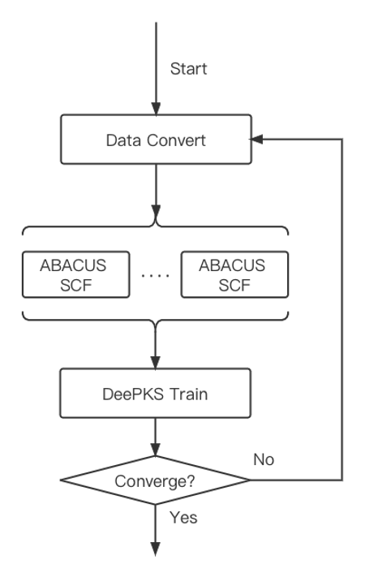
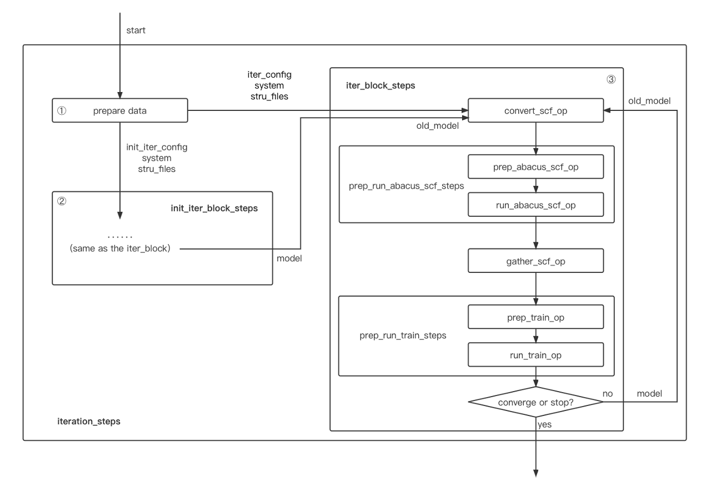

# Workflow which using dflow for DeePKS + ABACUS iteration

## Running this project
Considering your python environment, maybe you should install some python package first.

```
pip install -r requirements.txt
```
We need to build the latest version of `dflow`.
(Bug fixed at 2022.9.1, maybe do not need do this step after they upload the latest version to pip.)  
```
pip install git+https://github.com/deepmodeling/dflow
```
Then, install the deepks2, which is a DeePKS + ABACUS iteration workflow using dflow.
```
pip install .
cd ./example/water_single_lda2pbe_abacus/iter
```
Before you submit the example, you may regist a [Bohrium](https://bohrium.dp.tech) account and should modify some args around the end of `base_args.yaml`.

- `scf_machine:program_id; train_machine:program_id; lebesgue_context_config:extra:program_id`: input your program ID of your Bohrium program.
- `username`: input your Bohrium login account.
- `password`: input your Bohrium login password.
- `upload_python_package`: /path/to/deepks2 which you have just installed.

Now it's time to submit your workflow!
```
deepks2 iterate base_args.yaml
```
You can see the flow on this [website](http://39.106.93.187:32746).

## Details about this project
### Workflow
<div align=center>

</div>
Simple as you can see above, this workflow have got three main achievement:

- Iterative train of the DeePKS + ABACUS workflow.
- Parallel SCF calculation between different machines.
- Auto judgement of the iteration end point.
  
While using the dflow, we can specify every OP to use slurm, Bohrium or locol machine. But we do not need to make the OP environment because it is running in a well prepared image.All you need to do is preparing your input data and run.

### Step and OP design
<div align=center>

</div>

Cause we have the excellent work DPGEN2 as a reference, I have learned a lot from it.
The different between **init_iter_block_steps** and **iter_block_steps** are model and config which contains scf_config and train_config. We should get a model from **init_iter_block_steps** to input into **iter_block_steps**.
The Super-OP **iter_block_steps** can be reused so that the iteration number can be increased.