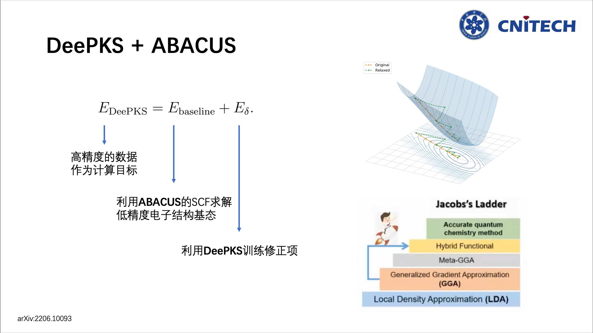

# Workflow which using dflow for DeePKS + ABACUS iteration

## Introduction
I am glad to participate in the [Hackathon](https://github.com/deepmodeling-activity/hackathon2022) activity in AI-assisted electronic structure calculations topic and have done this job with a minimum version, which I call deepks-flow.

This is a workflow which using [dflow](https://github.com/deepmodeling/dflow) for [DeePKS](https://github.com/deepmodeling/deepks-kit) + [ABACUS](https://github.com/deepmodeling/abacus-develop) iteration. This [iteration](https://arxiv.org/abs/2206.10093) can build a bridge between expensive Quantum Mechanical Models and Machine Learning Potentials, which will significant decrease the cost of high-level $ab$ $initio$ calculation.

<div align=center>

</div>

The outline of this work comes from [DPGEN2](https://github.com/deepmodeling/dpgen2), which is a well known work of Han Wang. Most of the functions in OP will call deepks package, so the deepks-flow is just a workflow. The code is not strong enough that I still have much to do for this project. Hopefully, I could grow up with the DeepModeling Community.

## Running this project
Considering your python environment, maybe you should install some python package first.

```
pip install -r requirements.txt
```
Then, it's time to install DeePKS-kit. This branch "abacus" works with ABACUS. 
```
pip install git+https://github.com/deepmodeling/deepks-kit@abacus
```
Then, install the deepks2, which is a DeePKS + ABACUS iteration workflow using dflow.
```
pip install .
cd ./example/water_single_lda2pbe_abacus/iter
```
Before you submit the example, you may regist a [Bohrium](https://bohrium.dp.tech) account and should modify some args around the end of `base_args.yaml`.

- `bohrium_program_id`: Input your program ID of your Bohrium program.
- `bohrium_account_name`: Input your Bohrium login account.
- `bohrium_account_password`: Input your Bohrium login password.
- `upload_python_package`: /path/to/deepks2 and /path/to/deepks which you have just installed.
- `dflow_config_host` and `dflow_config_s3_endpoint`: Write down your `host` and `s3_endpoint` of argo. See [dflow](https://github.com/deepmodeling/dflow) and [workflow_dp](http://39.106.93.187:32746/help) for recommendation.

Now it's time to submit your workflow!
```
deepks2 iterate base_args.yaml
```
You can see the flow on this [website](http://39.106.93.187:32746).

## Details about this project
### Workflow
<div align=center>

</div>
Simple as you can see above, this workflow have got three main achievement:

- Iterative train of the DeePKS + ABACUS workflow.
- Parallel SCF calculation between different machines.
- Auto judgement of the iteration end point.
  
While using the dflow, we can specify every OP to use slurm, Bohrium or locol machine. But we do not need to make the OP environment because it is running in a well prepared image.All you need to do is preparing your input data and run.

### Step and OP design(Outdated)
<div align=center>

</div>

Cause we have the excellent work DPGEN2 as a reference, while making this project, I have learnt a lot from it.
The different between **init_iter_block_steps** and **iter_block_steps** are model and config which contains scf_config and train_config. We should get a model from **init_iter_block_steps** to input into **iter_block_steps**.
The Super-OP **iter_block_steps** can be reused so that the iteration number can be increased.

### 中文文档
[中文文档](https://vks4ujoqp8.feishu.cn/docx/doxcnAywuNxkdsNTBnkTXDs1jRc)，含TODO